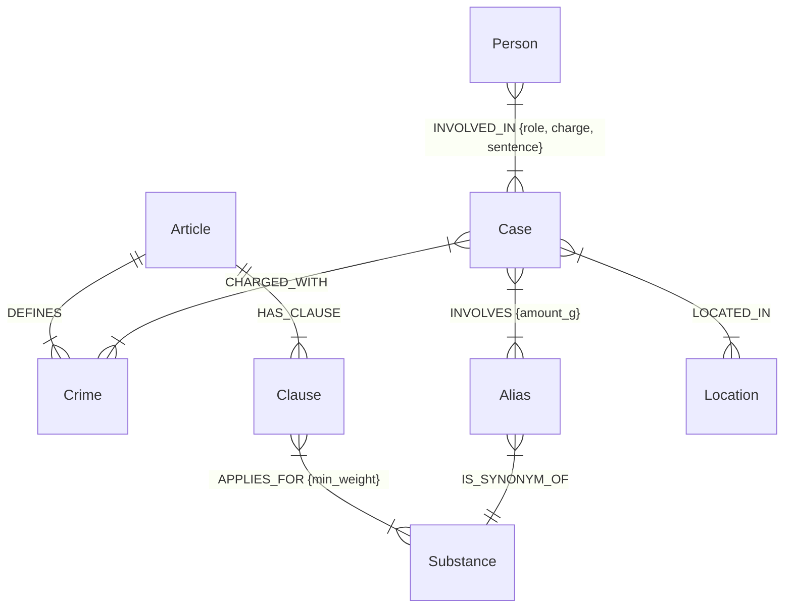

# Ontology Design

**Họ tên:** Phạm Đình Bảo Khôi  **MSSV:** 2A202602434  **Ngày:** 2026-10-05

## 1. Các loại thực thể (Node Labels)

| Label | Thuộc tính (Properties) | Ý nghĩa / Giải thích |
| --- | --- | --- |
| `Article` | `id`, `title`, `law`, `doc_id` | Một "Điều" luật (VD: Điều 251 BLHS). |
| `Clause` | `id`, `number`, `penalty`, `text`, `doc_id` | Một "Khoản" thuộc một Điều luật cụ thể. |
| `Crime` | `name` | Tên tội danh chuẩn hóa. Đóng vai trò cầu nối 2 KB. |
| `Substance` | `name` | Tên hóa chất/ma túy danh pháp khoa học chuẩn hóa. |
| `Alias` | `name` | Từ lóng, tên gọi thường ngày của ma túy mà báo chí sử dụng. |
| `Case` | `name`, `summary`, `date`, `doc_id`, `source_title` | Một vụ án/sự việc cụ thể trên báo chí. |
| `Location` | `name` | Địa điểm xảy ra vụ án. |
| `Person` | `name`, `aliases` | Người tham gia hoặc liên quan đến vụ án. |

## 2. Các loại quan hệ (Relationship Types)

| Label nguồn | Quan hệ | Label đích | Thuộc tính quan hệ | Ý nghĩa |
| --- | --- | --- | --- | --- |
| `Article` | `DEFINES` | `Crime` | (Không) | Điều luật quy định về tội danh. |
| `Article` | `HAS_CLAUSE`| `Clause` | (Không) | Điều luật bao gồm các Khoản nhỏ. |
| `Clause` | `APPLIES_FOR`| `Substance`| `min_weight` (float) | Khoản luật áp dụng cho chất ma túy này với mức phạt tính từ ngưỡng khối lượng chỉ định (gam). |
| `Alias` | `IS_SYNONYM_OF`| `Substance`| (Không) | Map từ lóng ma túy về chuẩn danh pháp khoa học. |
| `Case` | `CHARGED_WITH`| `Crime` | (Không) | Vụ án khởi tố tội danh nào. |
| `Case` | `INVOLVES` | `Alias` | `amount_g` (float) | Vụ án thu giữ chất ma túy (tên lóng) với khối lượng bao nhiêu gam. |
| `Case` | `LOCATED_IN`| `Location` | (Không) | Vụ án xảy ra ở đâu. |
| `Person` | `INVOLVED_IN`| `Case` | `role`, `charge`, `sentence` | Vai trò, mức án và tội danh của bị cáo/người liên quan. |

## 3. Lý do chọn `Crime` làm cầu nối (Bridge Node)
Tội danh (`Crime`) là điểm giao thoa tự nhiên nhất giữa Hệ thống Pháp luật (quy định tội danh) và Báo chí (đưa tin về tội phạm). Nếu không có cầu nối này, GraphRAG sẽ không thể biết được vụ án mà báo viết phải bị xét xử bằng Điều luật nào trong Bộ Luật Hình sự. Bằng cách chuẩn hóa tên Tội danh, chúng ta biến nó thành "đường ray" mượt mà kết nối 2 tập dữ liệu.

## 4. Sơ đồ Mermaid

## 5. Competency questions

> 5 câu hỏi truy vấn trực tiếp vào Neo4j (dùng Cypher) để kiểm tra xem thiết kế ontology có trả lời được các câu hỏi quan trọng không. (Trong code thực tế, các câu này do LLM tự gen hoặc dùng vector search kết hợp).

**Q1: Có những loại ma túy nào được nhắc đến trong bài báo A?**
- Tìm `Case` có `doc_id` = A, đi theo quan hệ `INVOLVES` -> `Alias` -> `IS_SYNONYM_OF` -> `Substance`. Trả về `Substance.name` và `Alias.name`.

**Q2: Tội "Mua bán trái phép chất ma túy" có các khung hình phạt nào?**
- Tìm `Crime {name: 'mua bán trái phép chất ma túy'}`, đi ngược qua `DEFINES` -> `Article`, từ đó đi tới `Clause`. Trả về `Clause.number` và `Clause.penalty`.

**Q3: Ai là người bị bắt trong các vụ án tại TP.HCM?**
- Tìm `Location {name: 'TP.HCM'}` <- `LOCATED_IN` - `Case` <- `INVOLVED_IN` - `Person`. Trả về `Person.name` và `role`.

**Q4: Các vụ án nào liên quan đến chất 'MDMA'?**
- Tìm `Substance {name: 'MDMA'}` <- `IS_SYNONYM_OF` - `Alias` <- `INVOLVES` - `Case`. Trả về `Case.name`.

**Q5: Cái Quang Huy bị truy tố về tội gì với loại ma túy nào?**
- Tìm `Person {name: 'Cái Quang Huy'}`, đi tới `Case`. Từ `Case` đi tới `Crime` và `Alias` -> `Substance`. Trả về `Crime.name`, `Substance.name` và `amount_g`.

## 6. Đánh giá (Trade-offs)
**Được:**
- Ontology mới xử lý cực tốt vấn đề từ lóng ma túy bằng Node `Alias`, không lo gãy cầu nối.
- Việc so sánh khối lượng nay được Graph thực hiện một phần (bằng `amount_g >= min_weight`), giúp lọc bớt các khoản luật rác.

**Mất:**
- Khâu trích xuất tin tức đòi hỏi LLM thông minh để ép kiểu khối lượng sang `float` thay vì chuỗi text tùy ý.
- Độ phức tạp của câu lệnh Cypher (cả khi Build và Query) tăng lên do xuất hiện thêm Node `Alias`.

## 7. So với ontology gợi ý (Dành cho +15 điểm bonus)
Thay đổi 1: **Mô hình hóa Khối lượng (Weight Thresholds)**
- Thay vì chỉ có `(:Clause)-[:MENTIONS]->(:Substance)`, Ontology này dùng `APPLIES_FOR {min_weight: float}` và ép tin tức trích xuất `amount_g: float`. Nó giải quyết triệt để vấn đề LLM nhầm Khoản luật, vì Graph đã giúp lọc tự động: `WHERE inv.amount_g >= p.min_weight`. Bổ sung cờ `fetch_all` để lấy trọn điều luật cho các câu hỏi về "hình phạt cao nhất/tối đa".

Thay đổi 2: **Giải quyết Từ lóng (Substance Aliases)**
- Báo chí hay dùng từ lóng (kẹo, đá, cỏ mỹ...). Thay vì sinh ra nhiều thực thể rời rạc gây đứt gãy, Ontology bổ sung `(:Alias)-[:IS_SYNONYM_OF]->(:Substance chuẩn)`. Mọi truy vấn đều chui qua Alias gom về một chất duy nhất, giúp Recall tăng mạnh ở các vụ dùng tiếng lóng.
